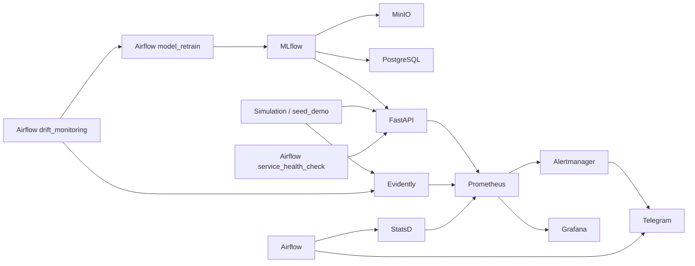
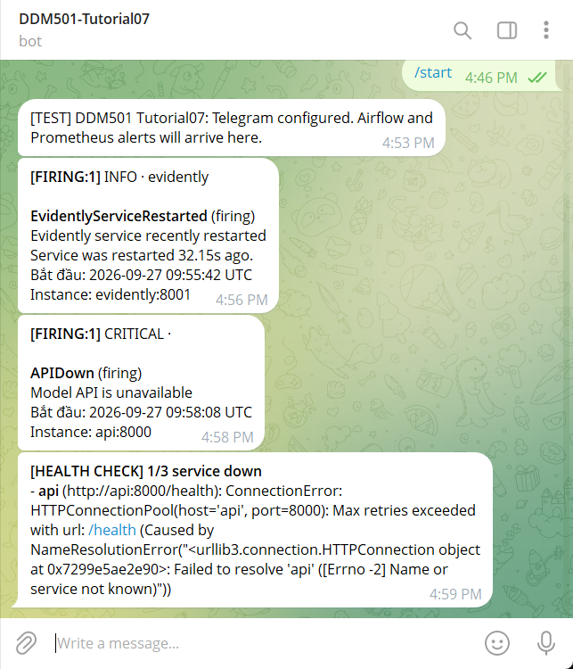

# DDM501 Tutorial07 — ML Monitoring Full Version

[](https://github.com/TrinhDucDuong/ddm501-Tutorial07-ml-monitoring-full-version/actions)

Triển khai theo [thaycacac/ddm501/tutorial07](https://github.com/thaycacac/ddm501/tree/main/tutorial07), đối chiếu commit `b13ae9ce1e24a8c34916a2758c52f31c4618d0cf`.
Kế thừa cấu trúc 3 DAG, training module, Telegram callback và native Alertmanager receiver của bài mẫu. Các ảnh bên dưới được chụp từ lần chạy của project này, không lấy ảnh của repo mẫu.

## Kiến trúc



| DAG | Lịch | Chức năng |
|---|---|---|
| `service_health_check` | 15 phút | Kiểm tra API, MLflow, Evidently; gửi Telegram nếu có lỗi |
| `drift_monitoring` | Mỗi giờ | Phân tích drift; gửi Telegram và trigger retrain khi vượt ngưỡng |
| `model_retrain` | Manual hoặc drift | Train → register → quality gate → promote Production → reload API → Telegram |

Task thất bại gửi callback `[AIRFLOW] Task failed`. Alert Prometheus đi qua Alertmanager, gửi cả firing và resolved. Airflow gửi Telegram theo cơ chế best effort; lỗi gửi tin được ghi vào task log.

## Chạy nhanh

Yêu cầu Docker Desktop chạy Linux containers, Docker Compose v2 và Python 3.10+. Lần build đầu cần tải dependencies và compile MinIO; nên cấp Docker ít nhất 8 GB RAM.

```powershell
Copy-Item .env.example .env
```

Điền `TELEGRAM_BOT_TOKEN`, `TELEGRAM_CHAT_ID` trong `.env`. Bot dùng cho evidence: **DDM501-Tutorial07** (`@mrduovn_bot`). Gửi `/start` cho bot trước. Nếu chưa biết chat ID riêng, để trống rồi chạy script cấu hình; script lấy private chat gần nhất trong updates của bot.

```powershell
python scripts/configure_telegram.py --test
docker compose up -d --build
docker compose run --rm trainer
docker compose run --rm trainer python /scripts/seed_demo.py --analyze
docker compose exec airflow-scheduler airflow dags list-import-errors
```

Script cấu hình tạo `secrets/telegram_bot_token` để Alertmanager đọc. `.env`, `secrets/` và dữ liệu runtime đều được gitignore. Cần chạy script **trước** `docker compose up` để token file tồn tại. Trên Bash có thể dùng `scripts/test_telegram.sh` theo bài mẫu.

| Dịch vụ | URL local | Đăng nhập demo |
|---|---|---|
| Airflow | http://localhost:18070 | admin / admin |
| API / OpenAPI | http://localhost:8000/docs | — |
| Evidently / reports | http://localhost:8001/reports | — |
| MLflow | http://localhost:5000 | — |
| Prometheus | http://localhost:9090/alerts | — |
| Alertmanager | http://localhost:9093 | — |
| Grafana | http://localhost:3000 | admin / admin |
| MinIO console | http://localhost:9001 | minio / minio123 |

Đây là stack thực hành chạy local. Các cổng host chỉ bind `127.0.0.1`; thông tin đăng nhập mặc định chỉ dành cho demo.

## Kiểm thử theo bài mẫu

### 1. Retrain thành công

```powershell
docker compose exec airflow-scheduler airflow dags trigger model_retrain
```

Kỳ vọng DAG xanh, version mới trên MLflow, API phục vụ đúng version, bot nhận `[RETRAIN] Model promoted to Production`.

### 2. Drift tự kích hoạt retrain

```powershell
docker compose run --rm trainer python /scripts/seed_demo.py --drift --analyze
docker compose exec airflow-scheduler airflow dags trigger drift_monitoring
```

Script dùng dataset wine 13 features, dịch phân phối 4 độ lệch chuẩn. Kỳ vọng `drift_detected=true`, metric theo từng feature, báo cáo HTML và nhánh `alert_drift → trigger_model_retrain`. Simulator trong `simulations/` cũng có thể gửi dữ liệu qua `/capture`.

Khôi phục dữ liệu bình thường sau demo:

```powershell
docker compose run --rm trainer python /scripts/seed_demo.py --analyze
```

`seed_demo.py` thay reference và xóa production samples của **Evidently trong stack này**, rồi nạp 178 samples kiểm thử.

### 3. Task failure / quality gate

Trong Airflow UI, trigger `model_retrain` với config:

```json
{"min_accuracy": 1.01, "reason": "intentional failure alert test"}
```

Accuracy không thể vượt 1.01: `quality_gate` phải đỏ, version không được promote, bot nhận `[AIRFLOW] Task failed`. Đây là lần chạy thất bại có chủ đích để kiểm thử alert.

### 4. Prometheus → Alertmanager → Telegram

```powershell
docker compose stop api
# Chờ APIDown firing (for: 1m + scrape/evaluation + group_wait).
# Có thể trigger service_health_check trong thời gian này.
docker compose start api
```

Kỳ vọng bot nhận `APIDown` firing và resolved sau khi API phục hồi. Xem http://localhost:9090/alerts và http://localhost:9093.

## Evidence thực tế

Chụp ngày 27/09/2026 từ bot **DDM501-Tutorial07**. Token và chat ID không xuất hiện trong ảnh.

### Prometheus firing và Airflow health check



## Các sửa lỗi so với bản ban đầu

- API dùng đúng MLflow cổng nội bộ `5000`; đồng bộ MLflow 2.17.2.
- Mount đúng Prometheus rules, bật Alertmanager và StatsD mapping; kiểm tra scheduler bằng heartbeat rate.
- Parse `DataDriftTable` cho từng feature, xuất missing-value ratio và timestamp phân tích; áp dụng threshold request.
- Training module được dùng lại bởi Airflow; quality gate chặn promote khi accuracy thấp.
- Ví dụ API khớp dataset wine 13 features; giữ đúng HTTP status khi model chưa sẵn sàng.
- MinIO được build từ source release `RELEASE.2025-09-07T16-13-09Z` vì registry/binary URL cũ không còn tải được tại thời điểm kiểm thử. Source MinIO theo giấy phép AGPL-3.0, được giữ trong image.
- Pin `cloudpickle` tương thích dependencies sẵn có của image Airflow.

## CI và xử lý lỗi

GitHub Actions kiểm tra Compose, cú pháp Python, Prometheus rules, train/register/predict, drift với dữ liệu bình thường và dữ liệu lệch, cùng import đầy đủ 3 DAG. CI không gửi tin Telegram và không cần token.

```powershell
docker compose ps -a
docker compose logs --tail 100 airflow-scheduler
docker compose logs --tail 100 alertmanager
docker compose exec airflow-scheduler airflow dags list-import-errors
```

- Token/chat thay đổi: chạy lại `python scripts/configure_telegram.py --test`, rồi recreate `alertmanager airflow-webserver airflow-scheduler`.
- DAG đã tồn tại ở trạng thái paused: unpause trong UI hoặc `airflow dags unpause <dag_id>`.
- API báo chưa có model: chạy trainer rồi `seed_demo.py` để reload.
- Evidently giữ production samples trong RAM; sau restart cần chạy simulator/seed lại. Reference và reports được lưu ở Docker volumes.
- `docker compose down` dừng stack và giữ dữ liệu; `down -v` xóa dữ liệu của project.
